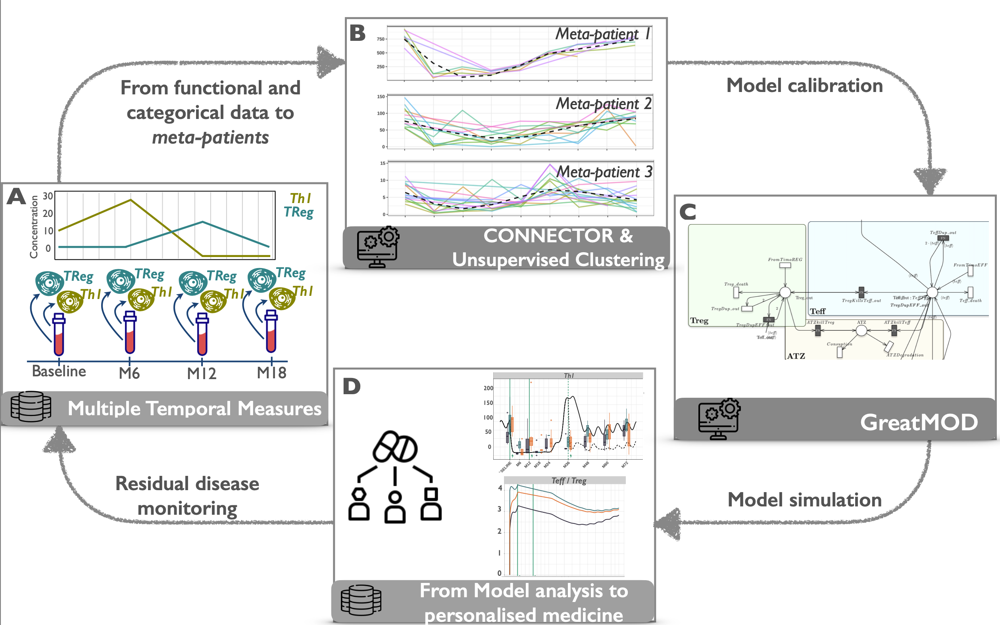

# GreatNector applied for the analysis of MS patients

## Workflow

**GreatNector** is designed by
combining [CONNECTOR](https://qbioturin.github.io/connector/), a data-driven framework for the clustering of longitudinal data, and [GreatMod](https://qbioturin.github.io/epimod/), a quantitative modeling framework based on the Petri Net formalism and its generalizations.

**GreatNector** workflow is a valuable tool for (i) the analysis and clustering of patient-derived longitudinal data, and (ii) the simulation of the resulting model patient-specific disease dynamics. 

## Application

We exploited longitudinal data of four immune cell populations collected from Multiple Sclerosis patients. GreatNector analysis was able to stratify individual patients into three model meta-patients whose dynamics suggested insight into patient-tailored intervention

## GIT structure

1. *LongData-CONNECTOR*: folder storing the files for running the clustering step.

    - *DataPreparation.R*: script for reading and elaborating the raw data in a CONNECTOR input format;
    
    - *MainConnector.R*: script for runnig CONNECTOR on the four cell types;
    
    - *DataInvestigation.Rmd*: script for generating the report in which the CONNECTOR clusters are analysed and grouped to run the kmeans clustering. The kmeans clustering will define the meta-patients.
    
    - *PlotPaper.R*: script to generate the plots reported in the main paper *A new computational workflow to guide personalized drug therapy.*(Under Review) .
    
    - *Data/ALEMTUZUMAB_DATA_Connector.xlsx*: the patient-derived longitudinal raw data;

2. *Model-GreatMod*: folder storing the files for running the modeling step.

    - *MAIN.R*: main script to run the package *epimod* for the simulation of the model;
    
    - *MPMS1*, *MPMS2*, *MPMS3*: folders stroing the simulations considering the three meta-patients
    
    - *Net*: folder storing the Petri Net model (*MS_Model.PNPRO*) and the cpp functions associated with the general transitions.

